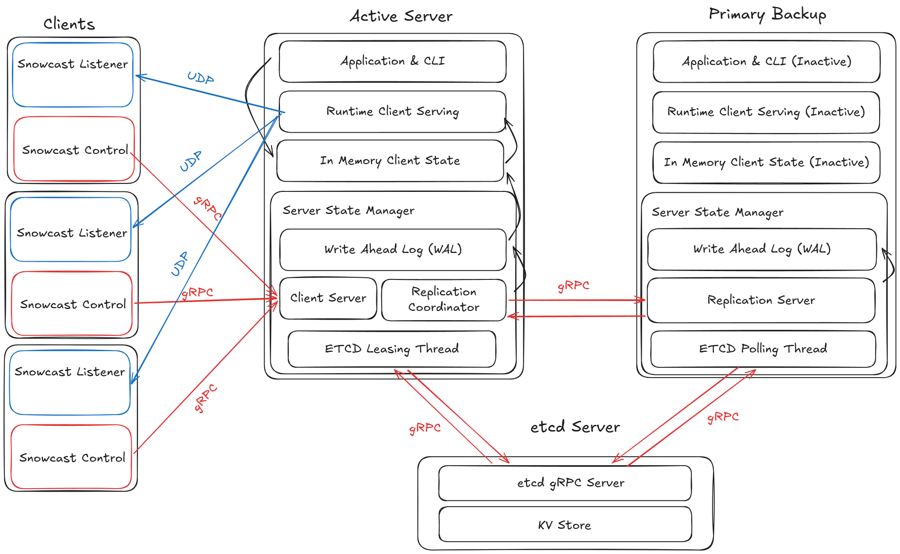

# Overview

Snowcast is a fault tolerant audio streaming backend service. Clients are able to connect to the server and switch between different music stations that are being streamed. The system is designed to be resilient to server failure and network partitions, and in extreme cases choses consistency by temporarily disabling services to clients as opposed to availability and having to reconcile broken internal state.

The project was originally created as a class project for a computer networking class I took, but I extended the project significantly to use a more modern networking protocol (gRPC) and to turn it into a distributed system built for fault tolerance.

# Project Design

Snowcast has many features at different layers of application stack. To understand how everything works together, I think it's best to start from the lowest layer of abstraction and work upwards.

## Networking and Storage Primitives

The most fundamental networking and storage functions are located in /pkg/protocol and /pkg/wal respectively. /pkg/protocol contains all of the gRPC service methods, as well as the compiled stubs and server skeletons after running through the protobuf compiler. These signatures define the structure of client-server and server-server networking protocols, as well as data structures such as WalEntry that standardizes how state is stored. /pkg/wal contains the lowest level implementation of the write ahead log (WAL), which at this layer is a thin wrapper over a os.File struct, which itself is a thin wrapper over a file descriptor. At this layer, the wal abstraction provides utilities such as reading and writing WalEntries to the file, and keeping track of a monotonically increasing sequence number.

## Server State Management

Built on top of the storage and networking primitives but below the application layer is the server state manager. This process runs on both the primary and backup servers, and is responsible for handling client-server and server-server communication, managing internal WAL state, updating in memory data structures, and continuously polling the etcd server to determine system state. Relevant services are located at /internal/node, /internal/replication, /internal/runtime, /internal/leadership, and /internal/state.

### State Manager - /internal/node

The top level manager at this layer is located at /internal/node. Importantly the manager struct holds references to gRPC server structs for both replication and client serving (only one of which is active at a time), a reference to the etcd client connection struct, and a reference to the WAL. The manager is responsible for launching all relevant on servers on startup, and handling leader/backup state transistion in the event of server failure or network partition when etcd lease changes.

### Server-Server Communication - /internal/replication

One of the main roles of the state manager is to handle server to server communication. This is the heart of Snowcast's system design. This folder contains the three different types of servers that are under the state manager. Importantly, only one of the three servers is active at the same time on the same server. The three servers are the Coordinator server struct which is the server running on the primary that manages replication to a remote backup, the Replserver struct which runs on the backup and handles incoming messages from the primary's Coordinator server, and the LocalCoordinator struct which is the same as the Coordinator struct but doesn't manage replication on a remote backup. The purpose of the LocalCoordinator is to continue service even when the backup server is unreachable whether because of a crash or network partition. Each server is run in its own background goroutine to listen for connections, and requests are dispatched to their own handler goroutine.

Every state mutating RPC that is sent by any client passes through these servers in its hot path. Importantly every server here implements the ReplicateAndWait() abstract function defined in /internal/control/grpc.go, which allows requests higher in the application stack to interact with the networking and storage primitives managed by this layer without needing to know their precise implementation. By implementing this function, these servers allow the system to have a durable log of all state changes, allowing for easy replay on server promotion and easy rollback and write failure. 

Snowcast also implements a synchronous replication model where the primary server must receive an acknowledgement from the backup before committing the state mutating change in its own WAL and returning to the client. This design decision reduces system throughput under high load since every write must wait for a round trip between primary and backup servers, but in return provides very robust guarantees on recovered state in the event of server failure and replay.

### Client-Server Communication - /internal/runtime

All communication between clients and the primary server is located at /internal/runtime. Notably the primary server must open two different types of connections between clients, one gRPC server that listens for incoming client requests (then forwarding to the writing and replication servers outlined above), and a separate per-station goroutine that streams audio to each client currently listening to each station. The main goroutine also blocks at handleUserInput() defined in this file, which handles administrator input to gather information such as which clients are currently listening to which stations.

### etcd Server and Leadership Promotion - /internal/leadership

A single primary server running alongside a backup is still vulnerable to a network partition failure mode where the primary is unable to reach the backup. In this case, the backup may think the primary has failed when it actually is still serving clients, and promotes itself creating two primaries. 

To resolve this problem, an etcd leasing system was introduced where the primary must hold a lease on a separate etcd server (which itself can be further scaled out to increase robustness), and the backup repeatedly queries the etcd server to check if the primary is still healthy. If the primary fails to renew its lease before expiration, the backup may attempt to hold it, and if successfully acquired, promotes itself to the new primary. After failing to renew the lease, the primary will stop serving clients, and continuing pinging the etcd server until connection is reestablished. If a new server has been promoted during that time, the old primary demotes itself to being a backup.

Under this new system, even in the event of a network partition where one of or both primary and backup servers are unable to reach the etcd server, there would never be a case where there exists two primaries simultaneously. Because etcd itself is backed by raft, it provides very strong consistency and would never report conflicting reports of the status of the primary server, at the cost of service unavailability during failover. All utilities related to 

### Miscallaneous Utilities - /internal/control & /internal/state

To keep the repository organized, all functions related to implementing the gRPC method signatures and for applying and rolling back in memory state to match the local WAL are located in /internal/control and /internal/state respectively.

## Application Layer

The top level application layer of Snowcast is located inside the /cmd folder. All files under this folder are compiled into an executable binary for running the system. The application layer of this project is fairly lightweight and the files here primarily are only responsible for parsing command line arguments and launching the backend services.

## Benchmarking

To record system benchmarks such as p99 replication latency and failover delay, testing artifacts were introduced at /cmd/snowcast_bench and /internal/bench. /cmd/snowcast_bench is a client tester, which continuously sends requests at variable throughput levels to benchmark system statistics. Likewise, the /internal/bench includes a set of hooks that run internally on the servers when testing, allowing for benchmarking of metrics such as WAL replay time.